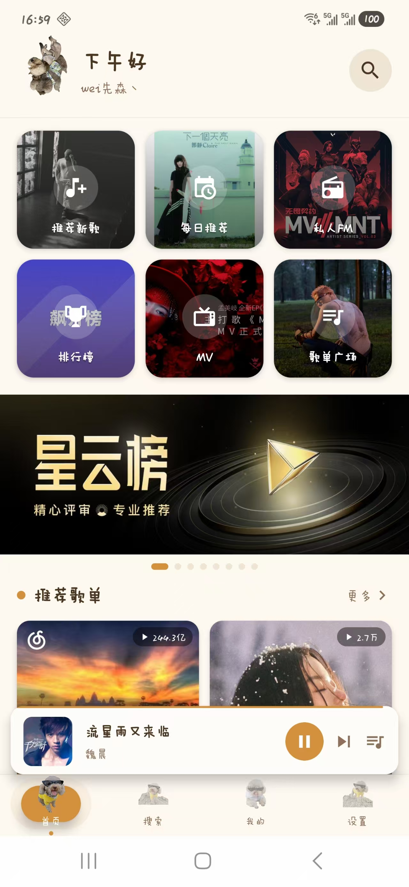
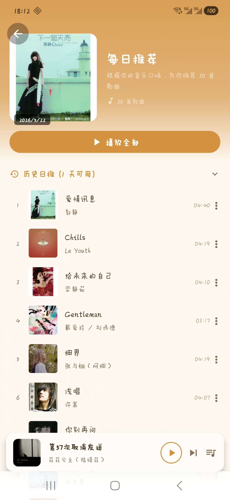
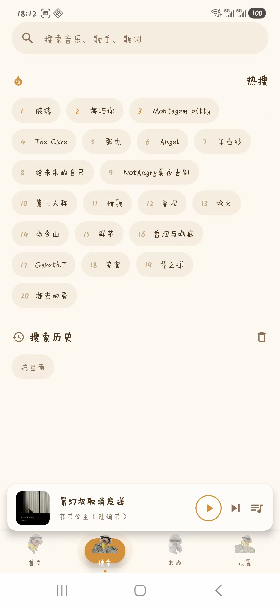
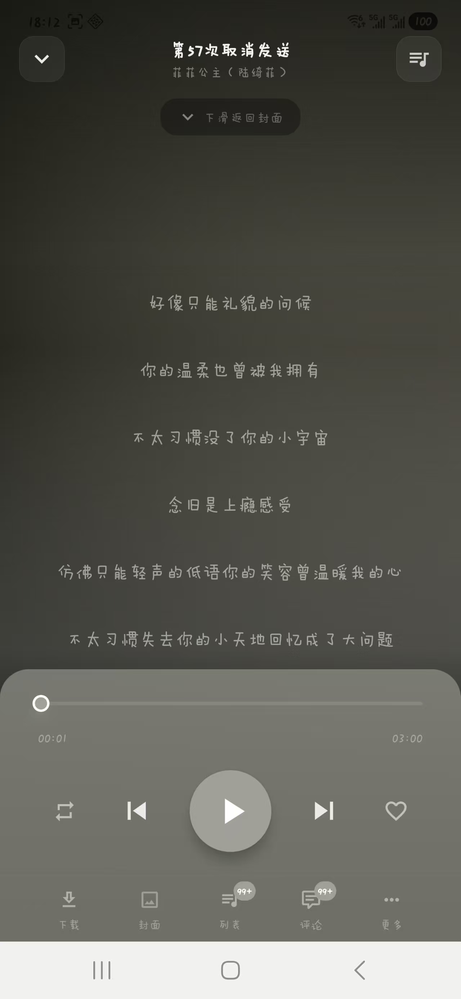

# 🎵 RanNuan Music Player

<div align="center">


**一款基于 React Native + Expo 的跨平台网易云音乐播放器**

[功能特性](#-功能特性) • [📸 截图展示](#-截图展示) • [快速开始](#-快速开始) • [技术架构](#-技术架构) • [开发文档](#-开发文档)

</div>

---

## 📱 功能特性

### 🎧 核心播放
- **在线播放** - 网易云音乐全曲库在线播放
- **多音源解析** - 灰色歌曲自动解锁（7 层策略引擎：bodian → qq → migu → kugou → kuwo → pyncmd → GDMusic → LxMusic）
- **后台播放** - 锁屏播放、通知栏/灵动岛控制、耳机按键切歌
- **播放模式** - 顺序播放、单曲循环、随机播放
- **Picture Disc 黑胶** - 封面满幅唱片旋转 + 动态取色渐变背景
- **双层呼吸光晕** - 播放按钮呼吸动画，暂停时消隐
- **自定义进度条** - PanResponder 手势拖动 + 自定义圆形拖拽点

### 📝 歌词系统
- **逐字歌词** - YRC 逐字歌词动画
- **翻译歌词** - 双语歌词显示
- **点击跳转** - 点击歌词行跳转播放位置
- **自动滚动** - 歌词跟随播放进度滚动

### 💬 评论社交
- **热门/最新** - Tab 切换 + `before` 深度分页
- **楼层回复** - 点击展开子评论
- **发表评论** - 底部输入框 + @用户名回复
- **点赞 + 抱抱** - 评论互动
- **长按举报** - 举报违规内容
- **全场景覆盖** - 歌曲/歌单/专辑/MV/歌手详情页均接入

### 👤 用户体系
- **多种登录** - 手机号/验证码/邮箱/二维码/游客模式
- **等级展示** - 金色进度条 + 三档 VIP 标签（黑胶VIP/VIP/普通）
- **关注/粉丝** - 关注列表 + 互关检测
- **编辑资料** - 昵称/签名/性别/生日/头像上传
- **歌单管理** - 创建/收藏分离展示

### 🧭 发现浏览
- **每日推荐** - 30首日推 + 历史日期回溯 + 不感兴趣
- **歌单广场** - 分类浏览全网歌单 + 热门标签
- **歌手探索** - 分类筛选（类型/地区/首字母）+ 5 Tab 详情
- **相似推荐** - 歌曲/歌单/MV/歌手的相似推荐

### 📥 下载管理
- **离线下载** - 歌曲下载队列
- **下载 toast** - 点击 toast → 直达下载管理页
- **完成通知** - 下载完成推送通知

### 📊 数据统计
- **播放历史** - 全部播放记录
- **听歌热力图** - GitHub 风格日历热力 + 播放统计卡片
- **MV 播放** - 全屏 MV 播放 + 自动暂停音乐防重叠
- **本地音乐** - 扫描设备本地音乐文件

### 🎨 用户体验
- **5 种主题** - 暗色/亮色 + 狗狗主题（light/dark）+ 多种模式
- **国际化** - 中文/英文切换
- **手势交互** - 下拉关闭播放页、滑动切 Tab
- **音源重选** - 歌曲三点菜单 → 手动选择音源重新解析
- **全局 Toast** - 友好操作反馈

---

## 📸 截图展示

> 以下为应用主要界面展示（点击查看大图）

| 播放器 | 首页 | 歌单详情 |
|:---:|:---:|:---:|
|  |  |  |

| 搜索 | 歌词 | 评论 |
|:---:|:---:|:---:|
|  |  |  |

| 歌手详情 | 用户中心 | 设置 |
|:---:|:---:|:---:|
|  |  |  |


---

## 🚀 快速开始

### 环境要求

- Node.js >= 18
- npm 或 yarn
- Expo CLI
- Android Studio / Xcode（用于原生构建）

### 安装依赖

```bash
git clone https://github.com/AARONWEI97/RanNuan-Music-Player.git
cd RanNuan-Music-Player

npm install
```

### 开发运行

```bash
# 启动 Metro 开发服务器
npm start

# Web 预览
npm run web
```

> ⚠️ 项目已迁移至 Development Build，使用 `npm start`（即 `expo start --dev-client --clear`）

### 构建 APK

```bash
# 安装 EAS CLI（首次）
npm install -g eas-cli

# 登录 Expo 账号（首次）
eas login

# 构建 Android APK
npx eas build --platform android --profile preview
```

---

## 🏗️ 技术架构

### 技术栈

| 层级 | 技术 | 说明 |
|------|------|------|
| 框架 | React Native 0.81 + Expo 54 | 跨平台移动应用框架 |
| 语言 | TypeScript 5.9 | 类型安全 |
| 状态管理 | Zustand 4.5 | 轻量级，内置 persist 持久化 |
| 路由 | React Navigation 7 | RN 生态标准导航 |
| 音频 | react-native-track-player 4.1 | 原生队列模式，后台播放 + 锁屏控制 |
| HTTP | Axios | 网络请求 + 拦截器 + 重试 |
| 存储 | AsyncStorage | 本地持久化存储 |
| 国际化 | i18next + react-i18next | 多语言 |
| 动态取色 | react-native-image-colors | 封面主题色提取 |
| 图片选择 | expo-image-picker | 头像上传 |

### 项目结构

```
├── app/
│   ├── api/              # API 接口层（18 个模块）
│   │   ├── index.ts      # 统一导出
│   │   ├── request.ts    # Axios 实例 + 拦截器
│   │   ├── music.ts      # 音乐/歌曲 API
│   │   ├── login.ts      # 登录 API
│   │   ├── user.ts       # 用户 API
│   │   ├── playlist.ts   # 歌单 API
│   │   ├── artist.ts     # 歌手 API
│   │   ├── album.ts      # 专辑 API
│   │   ├── comment.ts    # 评论 API（含举报/抱抱）
│   │   ├── mv.ts         # MV API
│   │   ├── search.ts     # 搜索 API
│   │   ├── home.ts       # 首页 API
│   │   ├── list.ts       # 排行榜 API
│   │   ├── simi.ts       # 相似推荐 API
│   │   ├── style.ts      # 曲风 API
│   │   ├── voice.ts      # 播客 API
│   │   └── advanced.ts   # 高级功能 API
│   ├── components/       # UI 组件
│   │   ├── comment/      # 评论组件
│   │   ├── lyric/        # 歌词组件
│   │   ├── music/        # 音乐列表/操作菜单
│   │   ├── player/       # MiniPlayer / PlaylistDrawer
│   │   └── ui/           # 基础 UI（Toast 等）
│   ├── constants/        # 常量配置
│   ├── hooks/            # 自定义 Hooks
│   ├── i18n/             # 国际化
│   ├── navigation/       # 路由配置
│   ├── screens/          # 页面（20+ 个）
│   ├── services/         # 服务层（播放/下载/音源解析）
│   ├── store/            # Zustand Stores（10+ 个）
│   ├── theme/            # 主题系统（5 种模式）
│   ├── types/            # TypeScript 类型定义
│   └── utils/            # 工具函数
├── assets/               # 图标/图片
├── App.tsx               # 应用入口
├── app.json              # Expo 配置
├── eas.json              # EAS Build 配置
└── MOBILE_DEV.md         # 详细开发文档
```

---

## 🔧 配置说明

### API 服务

本项目使用**远程公网 API 服务器**，无需本地部署后端：

| 服务 | 地址 | 用途 |
|------|------|------|
| 主 API | 公网服务器 `:3000` | 歌曲信息、歌单、登录、解灰 |
| GD 音乐台 | `music-api.gdstudio.xyz` | 备用音源 fallback |
| 落雪音乐 | `lxmusicapi.pages.dev` | 音源解析备用 |

> 打包后直接安装使用，无需任何后端部署。如需修改 API 地址，在应用内：**设置 → 网络 → API 地址**

### 音源解析策略链

```
播放请求 → UnblockApiMatch (bodian→qq→migu→kugou→kuwo→pyncmd→auto)
         → GDMusic (netease→joox→tidal)
         → LxMusic
         → UnblockMusicService
         → FallbackApi
```

配置路径：**设置 → 音源解析**，支持启用/禁用 + 自定义 API 地址

---

## 📖 开发文档

详细的技术文档、Phase 规划、API 对照表请查看 **[MOBILE_DEV.md](./MOBILE_DEV.md)**

### 开发进度

| Phase | 状态 | 核心功能 |
|-------|:---:|---------|
| Phase 1-10 | ✅ | 核心播放链 + 首页 + 搜索 + 登录 + 歌词 + 音源解析 + 下载 + 主题 |
| Phase 11 | 🚧 | API 功能补齐 — 7/18 模块（用户/歌手/歌单/评论/推荐/高级 ✅） |
| Phase 12 | ✅ | 播放模块终极修复（锁屏切歌/错误重试/双重触发 等 12 项） |
| Phase 13 | ✅ | 歌手详情 UI 修复 + MV 播放音频冲突修复 |

> **当前版本可打包发布**，核心功能完善。剩余模块后续按需迭代。

---

## 📦 核心依赖

```json
{
  "react": "19.1.0",
  "react-native": "0.81.5",
  "expo": "~54.0.33",
  "react-native-track-player": "^4.1.2",
  "zustand": "^4.5.0",
  "@react-navigation/native": "^7.2.4",
  "axios": "^1.16.1",
  "i18next": "^26.2.0",
  "react-i18next": "^17.0.8",
  "react-native-image-colors": "^2.5.2",
  "expo-image-picker": "~17.0.11"
}
```

---

## 🤝 贡献指南

欢迎提交 Issue 和 Pull Request！

1. Fork 本仓库
2. 创建特性分支 (`git checkout -b feature/AmazingFeature`)
3. 提交更改 (`git commit -m 'Add some AmazingFeature'`)
4. 推送到分支 (`git push origin feature/AmazingFeature`)
5. 提交 Pull Request

---

## 📄 许可证

本项目基于 MIT 许可证开源 - 详见 [LICENSE](LICENSE) 文件

---

## 🙏 致谢

- [NeteaseCloudMusicApi](https://github.com/Binaryify/NeteaseCloudMusicApi) - 网易云音乐 API
- [react-native-track-player](https://github.com/doublesymmetry/react-native-track-player) - 音频播放器
- [Expo](https://expo.dev/) - React Native 开发平台

---

<div align="center">

**⭐ 如果这个项目对你有帮助，请给一个 Star！⭐**

Made with ❤️ by [AARONWEI97](https://github.com/AARONWEI97)

</div>
